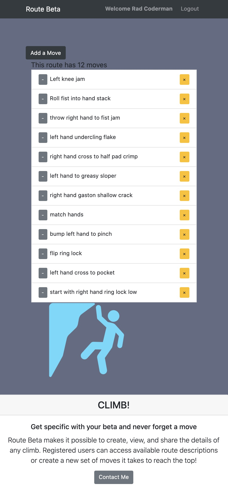
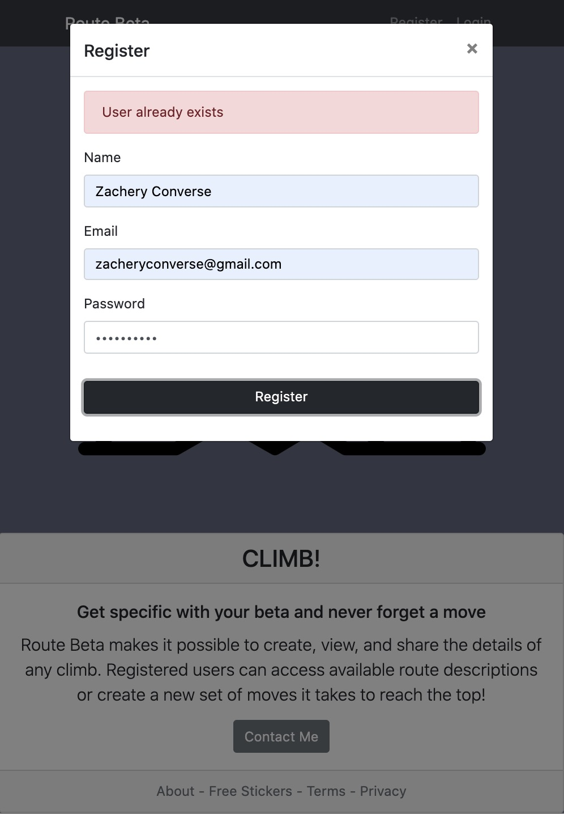

# Route Beta
> Route Beta as an app designed for rock climbers to create, view, and share the details (or beta) of every move of a route.
> Feel free to login with:
- email: code@gmail.com
- password: 12345

## Create || Read || Update || Delete

## Authentication

> This app was built with:
* React
* NodeJS
* Express
* MongoDB
* Redux
* JWT-authentication
* Bcrypt
* ReactStrap

> Deployed on Heroku @ https://safe-sierra-90220.herokuapp.com/

## Available Scripts

In the project directory, you can run:

### `npm start`

Runs the app in the development mode. 
Open [http://localhost:3000](http://localhost:3000) to view it in the browser.

The page will reload if you make edits. 
You will also see any lint errors in the console.
